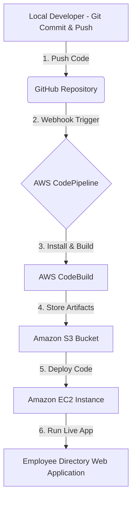
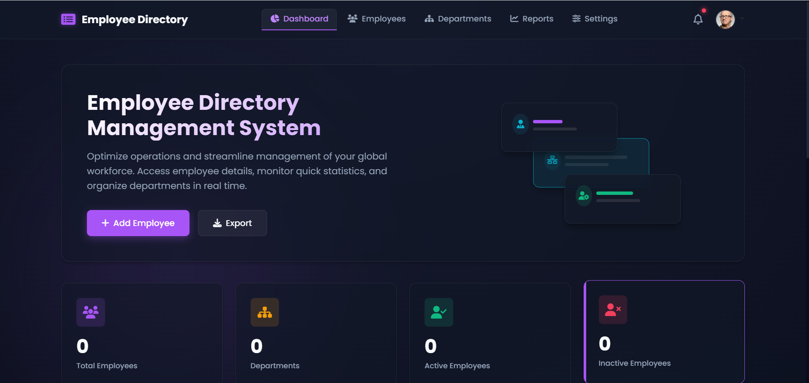
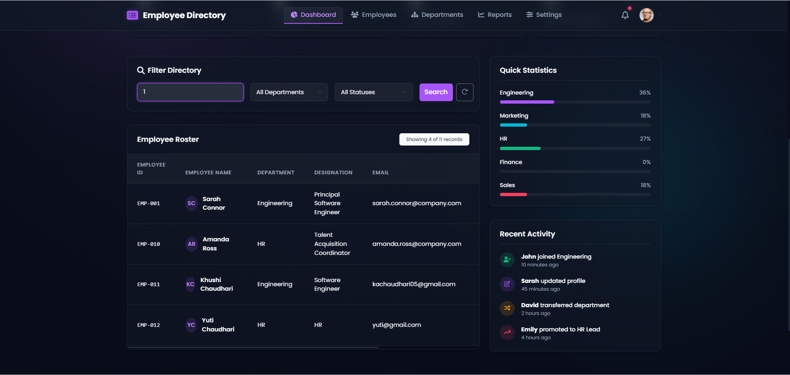
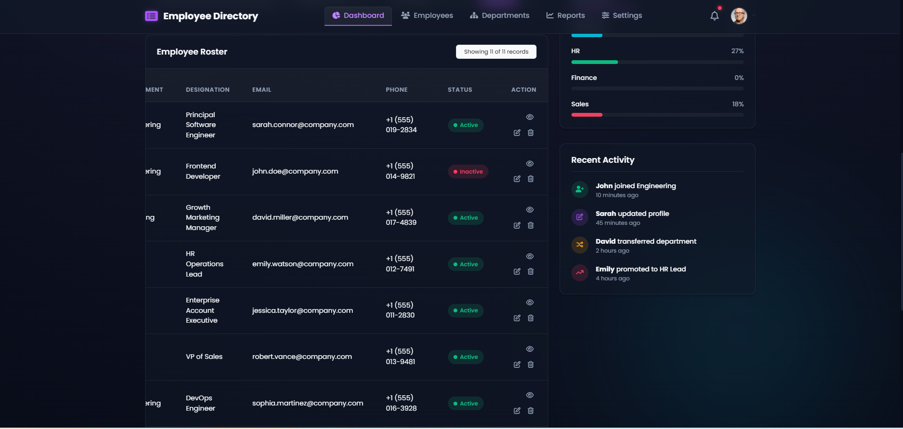
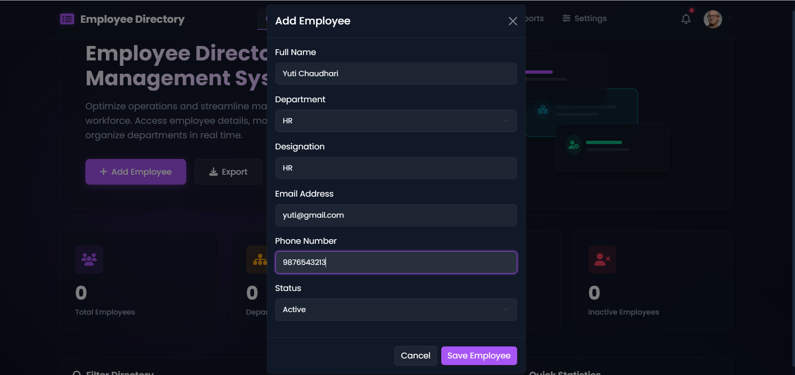
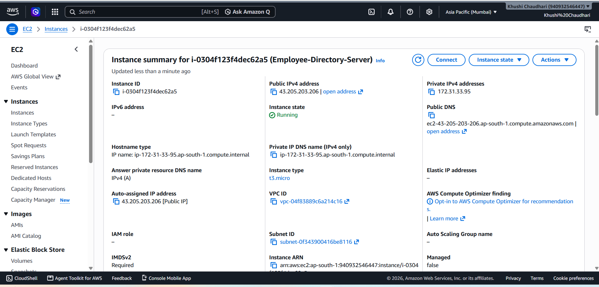
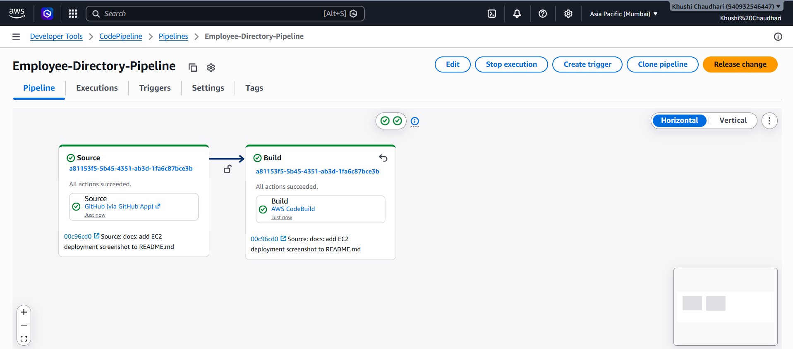
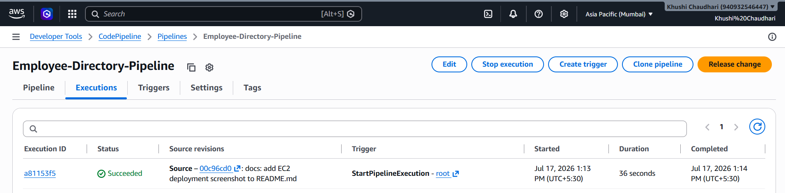

# Employee Directory - CI/CD Pipeline with AWS

[](https://nodejs.org/)
[](https://expressjs.com/)
[](https://aws.amazon.com/)
[](https://aws.amazon.com/ec2/)

A modern, enterprise-grade Employee Directory web application designed with premium aesthetics and built on a Node.js/Express.js backend. This project serves as a showcase for Continuous Integration and Continuous Deployment (CI/CD) pipelines utilizing AWS cloud services.

Whenever code is pushed to the `main` branch of this GitHub repository, AWS CodePipeline automatically triggers a build via AWS CodeBuild and deploys the updated codebase onto an Amazon EC2 instance.

---

## 🚀 Features

- **Dashboard Statistics**: Instant overview of total headcounts, unique departments, active employees, and inactive employees.
- **Dynamic Employee Directory**: Clean roster featuring user profile initials, department categorization, designations, email, and live status badges.
- **Full CRUD Management**: Visual and operational modals for adding, editing, viewing, and deleting employee records.
- **Client-Side Live Filtering**: Instantaneous query search and filters (by Name, ID, Designation, Department, or Status) operating live in the client browser.
- **Quick Statistics (Sidebar)**: Visual progress-bar distributions of employees per department, dynamically updated with database updates.
- **Toast Notifications**: Interactive slide-in alerts notifying administrators about create, update, or delete operations.
- **Automated CI/CD Pipeline**: Streamlined lifecycle from local Git push to AWS cloud hosting.

---

## 🛠️ Tech Stack

| Layer | Technologies Used |
|---|---|
| **Frontend** | HTML5, CSS3, JavaScript (Vanilla), Bootstrap 5, Font Awesome |
| **Backend** | Node.js, Express.js |
| **Storage** | Local JSON File Database (`employees.json`) |
| **Cloud / DevOps** | AWS CodePipeline, AWS CodeBuild, Amazon EC3, Amazon S3, IAM |
| **Version Control** | Git, GitHub |

---

## 📐 Project Architecture



### CI/CD Stage Breakdown:
1. **Source Stage (GitHub)**: Detects pushes to the `main` branch and pulls the updated source code.
2. **Build Stage (AWS CodeBuild)**: Downloads package dependencies, builds resources, runs tests, and prepares build artifacts according to `buildspec.yml`.
3. **Deploy Stage (Amazon EC2)**: Installs and runs the Express server on the cloud virtual machine instance.

---

## 📂 Project Structure

```text
employee-directory/
├── app.js                 # Express server & CRUD API endpoints
├── buildspec.yml          # AWS CodeBuild configuration file
├── employees.json         # JSON database storage
├── package.json           # Node project manifest & script commands
├── package-lock.json      # Node dependency lock file
├── public/
│   └── index.html         # Single-page frontend dashboard (HTML, CSS, JS)
└── screenshots/           # Application screenshots for documentation
    ├── homepage.png
    └── add-employee.png
```

---

## 🔌 REST APIs

| Method | Endpoint | Description | Status Code |
| :--- | :--- | :--- | :--- |
| **GET** | `/api/employees` | Retrieve list of all employees | `200 OK` |
| **GET** | `/api/employees/:id` | Fetch specific employee details by ID | `200 OK` / `404 Not Found` |
| **POST** | `/api/employees` | Add a new employee | `211 Created` / `400 Bad Request` |
| **PUT** | `/api/employees/:id` | Update fields of an existing employee | `200 OK` / `400 Bad Request` / `404 Not Found` |
| **DELETE** | `/api/employees/:id` | Delete employee record | `200 OK` / `404 Not Found` |

---

## 🔄 Workflows

### Application Data Flow
```text
User Action (Add/Edit/Delete)
  │
  ▼
Fetch API Call (Browser)
  │
  ▼
Express API Endpoint (app.js)
  │
  ▼
Read / Write Operations (fs module)
  │
  ▼
JSON Database Updated (employees.json)
  │
  ▼
State Updated & UI Rendered Instantly (DOM)
```

### Git-to-Cloud Pipeline Flow
```text
Developer Push ──> GitHub Repo ──> AWS CodePipeline ──> AWS CodeBuild ──> Amazon EC2 (Deploy)
```

---

## 📸 Screenshots

### Enterprise Dashboard Overview


### Employee Directory Roster Table


### Workforce Status & Metrics


### Add/Edit Employee Dialog Form


### AWS EC2 Deployment


### AWS CodePipeline Overview


### Successful Pipeline Execution


---

## 💻 Local Installation & Setup

Follow these simple steps to run the application locally:

1. **Clone the repository:**
   ```bash
   git clone https://github.com/KAChaudhari05/Employee-Directory.git
   ```
2. **Navigate into the project directory:**
   ```bash
   cd Employee-Directory
   ```
3. **Install npm dependencies:**
   ```bash
   npm install
   ```
4. **Start the Express server:**
   ```bash
   npm start
   ```
5. **Access the application:**
   Open [http://localhost:3000](http://localhost:3000) (or the fallback port indicated in the terminal console) in your web browser.

---

## 🎯 Learning Outcomes & DevOps Concepts

- **RESTful Architecture**: Implementing stateless HTTP methods mapping to server operations.
- **State Management & DOM Manipulation**: Managing data synchronization between server-side storage and client-side presentation without framework overhead.
- **Continuous Integration (CI)**: Automating unit installation and artifact assembly on remote cloud containers.
- **Continuous Deployment (CD)**: Setting up webhooks and policies to dynamically update application code running on AWS infrastructure.
- **Server Maintenance**: Port-bind error checks and process management in production-like settings.

---

## 🔮 Future Enhancements

* [ ] **Database Integration**: Migrate local JSON storage to MongoDB or PostgreSQL.
* [ ] **Identity & Access Management**: Add role-based authentication using JWT or Auth0.
* [ ] **Containerization**: Package app in Docker containers and orchestrate using Kubernetes (EKS).
* [ ] **Infrastructure as Code (IaC)**: Deploy and manage AWS resources using Terraform.
* [ ] **Monitoring & Alarms**: Implement AWS CloudWatch logs and metrics.
